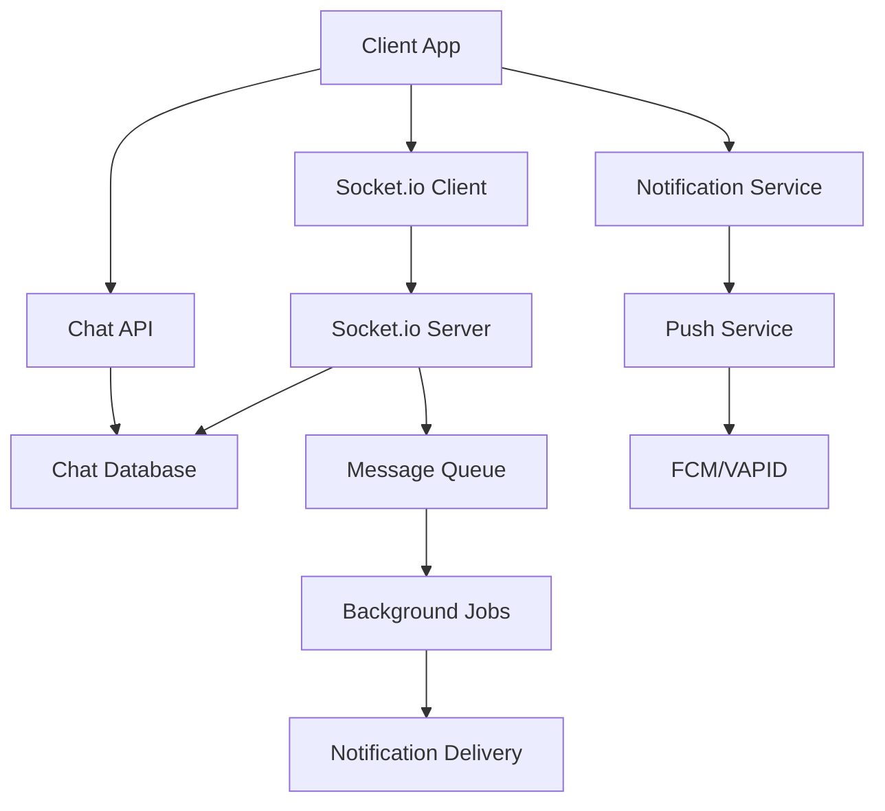

# 💬 StudentNest - Chat & Notifications System

## 📋 Table of Contents
- [Overview](#-overview)
- [Features](#-features)
- [Architecture](#-architecture)
- [Quick Start](#-quick-start)
- [Implementation Guide](#-implementation-guide)
- [API Documentation](#-api-documentation)
- [WebSocket Events](#-websocket-events)
- [Testing](#-testing)
- [Deployment](#-deployment)
- [Troubleshooting](#-troubleshooting)

---

## 🎯 Overview

StudentNest's Chat & Notifications system enables seamless real-time communication between students and room owners. The system provides instant messaging, comprehensive notification management, and integration with the booking workflow to enhance user experience.

### 🎪 Demo
- **Live Chat**: Real-time messaging with typing indicators
- **Smart Notifications**: Context-aware alerts for bookings, messages, and updates
- **Mobile Ready**: PWA-optimized with offline support
- **Secure**: User authentication and input validation

---

## ✨ Features

### 💬 Chat System
| Feature | Description | Status |
|---------|-------------|---------|
| **Real-time Messaging** | Instant chat with WebSocket support | ✅ Active |
| **Message Status** | Sent, delivered, read indicators | ✅ Active |
| **Typing Indicators** | Show when users are typing | ✅ Active |

### 🔔 Notification System
| Feature | Description | Status |
|---------|-------------|---------|
| **Push Notifications** | Browser and mobile push alerts | ✅ Active |
| **In-app Notifications** | Real-time notification center | ✅ Active |
| **Notification Preferences** | Granular user control | ✅ Active |
| **Smart Batching** | Intelligent notification grouping | ✅ Active |

---

## 🏗️ Architecture

### 🎨 System Design



### 📁 Project Structure

```
src/
├── components/
│   ├── chat/
│   │   ├── ChatWindow/
│   │   │   ├── index.jsx                # Main chat interface
│   │   │   ├── ChatHeader.jsx           # Chat header with user info
│   │   │   ├── MessageList.jsx          # Scrollable message container
│   │   │   ├── MessageInput.jsx         # Input component
│   │   │   └── ChatWindow.module.css    # Component styles
│   │   ├── Message/
│   │   │   ├── MessageBubble.jsx        # Individual message
│   │   │   ├── MessageStatus.jsx        # Read/delivered status
│   │   │   ├── MessageTime.jsx          # Timestamp display
│   │   │   └── MessageActions.jsx       # Message context menu
│   │   ├── ChatList/
│   │   │   ├── index.jsx               # Conversation list
│   │   │   ├── ChatItem.jsx            # Single conversation
│   │   │   └── ChatFilter.jsx          # Filter options
│   │   └── Common/
│   │       ├── TypingIndicator.jsx     # Typing animation
│   │       └── OnlineStatus.jsx        # User online status
│   ├── notifications/
│   │   ├── NotificationCenter/
│   │   │   ├── index.jsx               # Main notification hub
│   │   │   ├── NotificationList.jsx    # List of notifications
│   │   │   ├── NotificationItem.jsx    # Single notification
│   │   │   └── NotificationActions.jsx # Mark read, delete actions
│   │   ├── Toast/
│   │   │   ├── ToastContainer.jsx      # Toast notification wrapper
│   │   │   ├── ToastNotification.jsx   # Individual toast
│   │   │   └── ToastProvider.jsx       # Context provider
│   │   ├── Settings/
│   │   │   ├── NotificationSettings.jsx # User preferences
│   │   │   ├── PreferenceToggle.jsx    # Toggle components
│   │   │   └── ChannelSettings.jsx     # Channel-specific settings
│   │   └── Bell/
│   │       ├── NotificationBell.jsx    # Header bell icon
│   │       ├── Badge.jsx               # Unread count badge
│   │       └── DropdownMenu.jsx        # Quick actions menu
│   └── shared/
│       ├── Modal/                      # Reusable modal component
│       ├── Button/                     # Button variations
│       ├── Input/                      # Input components
│       └── Loading/                    # Loading states
├── contexts/
│   ├── ChatContext.jsx                 # Chat state management
│   ├── NotificationContext.jsx         # Notification state
│   ├── SocketContext.jsx               # WebSocket connection
│   └── AuthContext.jsx                 # User authentication
├── hooks/
│   ├── chat/
│   │   ├── useChat.js                  # Chat operations
│   │   ├── useChatList.js              # Conversation management
│   │   ├── useMessageStatus.js         # Message status tracking
│   │   └── useTypingIndicator.js       # Typing state management
│   ├── notifications/
│   │   ├── useNotifications.js         # Notification management
│   │   ├── usePushNotifications.js     # Push notification setup
│   │   ├── useToast.js                 # Toast notifications
│   │   └── useNotificationPrefs.js     # User preferences
│   ├── socket/
│   │   ├── useSocket.js                # WebSocket connection
│   │   ├── useSocketEvent.js           # Event listeners
│   │   └── useConnectionStatus.js      # Connection monitoring
│   └── common/
│       ├── useLocalStorage.js          # Local storage helper
│       ├── useDebounce.js              # Debounce utility
│       └── useIntersectionObserver.js  # Scroll detection
├── services/
│   ├── api/
│   │   ├── chatAPI.js                  # Chat-related endpoints
│   │   ├── notificationAPI.js          # Notification endpoints
│   │   └── userAPI.js                  # User management
│   ├── socket/
│   │   ├── socketService.js            # WebSocket service
│   │   ├── messageHandler.js           # Message processing
│   │   └── eventEmitter.js             # Event management
│   ├── notifications/
│   │   └── pushService.js              # Push notifications
│   └── storage/
│       ├── cacheService.js             # Message caching
│       └── indexedDBService.js         # Offline storage
├── utils/
│   ├── chat/
│   │   ├── messageHelpers.js           # Message utilities
│   │   ├── chatHelpers.js              # Chat utilities
│   │   └── messageValidation.js        # Input validation
│   ├── notifications/
│   │   ├── notificationHelpers.js      # Notification utilities
│   │   ├── templateEngine.js           # Template processing
│   │   └── preferenceHelpers.js        # Settings utilities
│   ├── date/
│   │   ├── dateHelpers.js              # Date formatting
│   │   └── timeAgo.js                  # Relative time
│   └── common/
│       ├── constants.js                # App constants
│       ├── errorHandler.js             # Error handling
│       └── logger.js                   # Logging utility
├── styles/
│   ├── components/                     # Component-specific styles
│   ├── globals.css                     # Global styles
│   ├── variables.css                   # CSS variables
│   └── animations.css                  # Animation definitions
└── types/
    ├── chat.types.js                   # Chat type definitions
    ├── notification.types.js           # Notification types
    └── user.types.js                   # User types
```

---

## ⚡ Quick Start

### 🔧 Prerequisites

```bash
# Node.js version
node >= 16.0.0
npm >= 8.0.0

# Required environment variables
REACT_APP_SOCKET_URL=ws://localhost:3001
REACT_APP_API_BASE_URL=http://localhost:3000/api
REACT_APP_VAPID_PUBLIC_KEY=your_vapid_public_key
REACT_APP_FCM_CONFIG=your_firebase_config
```

### 🚀 Installation

```bash
# Install dependencies
npm install socket.io-client framer-motion lucide-react
npm install @hookform/resolvers yup date-fns
npm install workbox-precaching workbox-routing

# Development dependencies
npm install --save-dev @testing-library/react @testing-library/jest-dom
npm install --save-dev cypress start-server-and-test
```

### 🏃‍♂️ Running the Application

```bash
# Start development server
npm run dev

# Start with WebSocket server
npm run dev:with-socket

# Run tests
npm run test

# Run E2E tests
npm run test:e2e

# Build for production
npm run build
```

---

## 🛠️ Implementation Guide

### 1. 🎯 Setting Up Chat Context

```jsx
// contexts/ChatContext.jsx
import React, { createContext, useContext, useReducer, useEffect } from 'react';
import { chatReducer, initialChatState } from '../reducers/chatReducer';
import { socketService } from '../services/socket/socketService';
import { chatAPI } from '../services/api/chatAPI';

const ChatContext = createContext();

export const ChatProvider = ({ children }) => {
  const [state, dispatch] = useReducer(chatReducer, initialChatState);
  const { user } = useAuth();

  useEffect(() => {
    if (user?.id) {
      // Initialize socket connection
      socketService.connect(user.id, user.type);

      // Load existing conversations
      loadConversations();

      // Setup socket listeners
      setupSocketListeners();
    }

    return () => {
      socketService.disconnect();
    };
  }, [user]);

  const loadConversations = async () => {
    try {
      dispatch({ type: 'SET_LOADING', payload: true });
      const conversations = await chatAPI.getConversations();
      dispatch({ type: 'SET_CONVERSATIONS', payload: conversations });
    } catch (error) {
      dispatch({ type: 'SET_ERROR', payload: error.message });
    } finally {
      dispatch({ type: 'SET_LOADING', payload: false });
    }
  };

  const setupSocketListeners = () => {
    socketService.on('newMessage', (message) => {
      dispatch({ type: 'ADD_MESSAGE', payload: message });

      // Show toast notification if chat is not active
      if (state.activeChat?.id !== message.chatId) {
        showToast({
          type: 'message',
          title: message.senderName,
          message: message.content,
          action: () => setActiveChat(message.chatId)
        });
      }
    });

    socketService.on('messageStatusUpdate', (update) => {
      dispatch({ type: 'UPDATE_MESSAGE_STATUS', payload: update });
    });

    socketService.on('userTyping', (data) => {
      dispatch({ type: 'SET_TYPING', payload: data });
    });

    socketService.on('userOnline', (userId) => {
      dispatch({ type: 'SET_USER_ONLINE', payload: userId });
    });

    socketService.on('userOffline', (userId) => {
      dispatch({ type: 'SET_USER_OFFLINE', payload: userId });
    });
  };

  const sendMessage = async (chatId, content, type = 'text') => {
    const tempMessage = {
      id: `temp-${Date.now()}`,
      chatId,
      senderId: user.id,
      senderName: user.name,
      content,
      type,
      timestamp: new Date().toISOString(),
      status: 'sending'
    };

    // Optimistically add message to UI
    dispatch({ type: 'ADD_MESSAGE', payload: tempMessage });

    try {
      // Send via WebSocket
      const message = await socketService.sendMessage({
        chatId,
        recipientId: getRecipientId(chatId),
        content,
        type
      });

      // Update with server response
      dispatch({
        type: 'UPDATE_MESSAGE',
        payload: { tempId: tempMessage.id, message }
      });

    } catch (error) {
      dispatch({
        type: 'UPDATE_MESSAGE_STATUS',
        payload: { id: tempMessage.id, status: 'failed' }
      });
      console.error('Failed to send message:', error);
    }
  };

  const startChat = async (recipientId, initialMessage = null) => {
    try {
      const chat = await chatAPI.createOrGetChat(recipientId);
      dispatch({ type: 'SET_ACTIVE_CHAT', payload: chat });

      if (initialMessage) {
        await sendMessage(chat.id, initialMessage);
      }

      return chat;
    } catch (error) {
      console.error('Failed to start chat:', error);
    }
  };

  const markMessageAsRead = (messageId) => {
    socketService.markAsRead(messageId);
    dispatch({
      type: 'UPDATE_MESSAGE_STATUS',
      payload: { id: messageId, status: 'read' }
    });
  };

  const value = {
    ...state,
    sendMessage,
    startChat,
    markMessageAsRead,
    setActiveChat: (chatId) => dispatch({ type: 'SET_ACTIVE_CHAT', payload: chatId }),
    loadConversations
  };

  return (
    <ChatContext.Provider value={value}>
      {children}
    </ChatContext.Provider>
  );
};

export const useChat = () => {
  const context = useContext(ChatContext);
  if (!context) {
    throw new Error('useChat must be used within a ChatProvider');
  }
  return context;
};
```

### 2. 🎨 Creating the Chat Window Component

```jsx
// components/chat/ChatWindow/index.jsx
import React, { useState, useEffect, useRef } from 'react';
import { motion, AnimatePresence } from 'framer-motion';
import { Send, Phone, Video, MoreVertical } from 'lucide-react';
import { useChat } from '../../../contexts/ChatContext';
import { useSocket } from '../../../hooks/socket/useSocket';
import MessageList from './MessageList';
import MessageInput from './MessageInput';
import ChatHeader from './ChatHeader';
import TypingIndicator from '../Common/TypingIndicator';

const ChatWindow = ({ chatId, onClose }) => {
  const {
    activeChat,
    messages,
    sendMessage,
    markMessageAsRead,
    isTyping
  } = useChat();

  const { connectionStatus } = useSocket();
  const messagesEndRef = useRef(null);
  const inputRef = useRef(null);

  // Auto-scroll to bottom when new messages arrive
  useEffect(() => {
    scrollToBottom();
  }, [messages]);

  // Mark messages as read when chat becomes active
  useEffect(() => {
    if (chatId && messages.length > 0) {
      const unreadMessages = messages.filter(
        msg => !msg.read && msg.senderId !== currentUser.id
      );

      unreadMessages.forEach(msg => {
        markMessageAsRead(msg.id);
      });
    }
  }, [chatId, messages]);

  const scrollToBottom = () => {
    messagesEndRef.current?.scrollIntoView({
      behavior: 'smooth',
      block: 'end'
    });
  };

  const handleSendMessage = async (content, type = 'text') => {
    if (!content.trim()) return;

    try {
      await sendMessage(chatId, content, type);
      inputRef.current?.focus();
    } catch (error) {
      console.error('Failed to send message:', error);
    }
  };

  if (!activeChat) {
    return (
      <div className="flex items-center justify-center h-full bg-zinc-900 rounded-xl border border-zinc-800">
        <div className="text-center">
          <div className="w-16 h-16 bg-zinc-800 rounded-full flex items-center justify-center mx-auto mb-4">
            <MessageCircle className="w-8 h-8 text-zinc-400" />
          </div>
          <h3 className="text-zinc-300 font-medium mb-2">No chat selected</h3>
          <p className="text-zinc-500 text-sm">Choose a conversation to start messaging</p>
        </div>
      </div>
    );
  }

  return (
    <motion.div
      initial={{ opacity: 0, scale: 0.95 }}
      animate={{ opacity: 1, scale: 1 }}
      exit={{ opacity: 0, scale: 0.95 }}
      className="flex flex-col h-full bg-zinc-900 rounded-xl border border-zinc-800 overflow-hidden"
    >
      {/* Connection Status Indicator */}
      {connectionStatus !== 'connected' && (
        <div className="bg-amber-600 text-white text-sm py-1 px-4 text-center">
          {connectionStatus === 'connecting' ? 'Connecting...' : 'Connection lost. Retrying...'}
        </div>
      )}

      {/* Chat Header */}
      <ChatHeader
        chat={activeChat}
        onClose={onClose}
        onVideoCall={() => console.log('Start video call')}
        onVoiceCall={() => console.log('Start voice call')}
      />

      {/* Messages Area */}
      <div className="flex-1 overflow-hidden flex flex-col">
        <MessageList
          messages={messages}
          chatId={chatId}
          onMessageRead={markMessageAsRead}
        />

        {/* Typing Indicator */}
        <AnimatePresence>
          {isTyping && (
            <motion.div
              initial={{ opacity: 0, y: 10 }}
              animate={{ opacity: 1, y: 0 }}
              exit={{ opacity: 0, y: 10 }}
              className="px-4 pb-2"
            >
              <TypingIndicator userName={isTyping.userName} />
            </motion.div>
          )}
        </AnimatePresence>

        <div ref={messagesEndRef} />
      </div>

      {/* Message Input */}
      <MessageInput
        ref={inputRef}
        onSendMessage={handleSendMessage}
        disabled={connectionStatus !== 'connected'}
        placeholder={
          connectionStatus !== 'connected'
            ? 'Connecting...'
            : 'Type a message...'
        }
      />
    </motion.div>
  );
};

export default ChatWindow;
```

### 3. 🔔 Notification System Implementation

```jsx
// contexts/NotificationContext.jsx
import React, { createContext, useContext, useReducer, useEffect } from 'react';
import { notificationReducer, initialNotificationState } from '../reducers/notificationReducer';
import { notificationAPI } from '../services/api/notificationAPI';
import { pushService } from '../services/notifications/pushService';

const NotificationContext = createContext();

export const NotificationProvider = ({ children }) => {
  const [state, dispatch] = useReducer(notificationReducer, initialNotificationState);
  const { user } = useAuth();

  useEffect(() => {
    if (user?.id) {
      initializeNotifications();
      setupPushNotifications();
    }
  }, [user]);

  const initializeNotifications = async () => {
    try {
      // Load notification preferences
      const preferences = await notificationAPI.getPreferences();
      dispatch({ type: 'SET_PREFERENCES', payload: preferences });

      // Load notification history
      const notifications = await notificationAPI.getNotifications();
      dispatch({ type: 'SET_NOTIFICATIONS', payload: notifications });

    } catch (error) {
      console.error('Failed to initialize notifications:', error);
    }
  };

  const setupPushNotifications = async () => {
    try {
      const subscription = await pushService.subscribe();
      if (subscription) {
        await notificationAPI.updatePushSubscription(subscription);
        dispatch({ type: 'SET_PUSH_ENABLED', payload: true });
      }
    } catch (error) {
      console.error('Failed to setup push notifications:', error);
    }
  };

  const showToast = (notification) => {
    const toastId = `toast-${Date.now()}`;
    const toast = {
      ...notification,
      id: toastId,
      timestamp: new Date().toISOString()
    };

    dispatch({ type: 'ADD_TOAST', payload: toast });

    // Auto-remove after delay
    setTimeout(() => {
      dispatch({ type: 'REMOVE_TOAST', payload: toastId });
    }, notification.duration || 5000);

    return toastId;
  };

  const addNotification = (notification) => {
    const fullNotification = {
      ...notification,
      id: notification.id || `notif-${Date.now()}`,
      timestamp: new Date().toISOString(),
      read: false
    };

    dispatch({ type: 'ADD_NOTIFICATION', payload: fullNotification });

    // Show toast if enabled
    if (state.preferences.showToasts) {
      showToast({
        type: notification.type,
        title: notification.title,
        message: notification.message,
        action: notification.action
      });
    }

    // Send push notification if enabled and page not visible
    if (state.preferences.pushEnabled && document.hidden) {
      pushService.showNotification(notification.title, {
        body: notification.message,
        icon: notification.icon || '/icons/default-notification.png',
        tag: notification.type,
        data: notification.data
      });
    }
  };

  const markAsRead = async (notificationId) => {
    try {
      await notificationAPI.markAsRead(notificationId);
      dispatch({ type: 'MARK_AS_READ', payload: notificationId });
    } catch (error) {
      console.error('Failed to mark notification as read:', error);
    }
  };

  const markAllAsRead = async () => {
    try {
      await notificationAPI.markAllAsRead();
      dispatch({ type: 'MARK_ALL_AS_READ' });
    } catch (error) {
      console.error('Failed to mark all notifications as read:', error);
    }
  };

  const updatePreferences = async (newPreferences) => {
    try {
      const updated = await notificationAPI.updatePreferences(newPreferences);
      dispatch({ type: 'SET_PREFERENCES', payload: updated });

      // Update push subscription if needed
      if (newPreferences.pushEnabled && !state.preferences.pushEnabled) {
        await setupPushNotifications();
      } else if (!newPreferences.pushEnabled && state.preferences.pushEnabled) {
        await pushService.unsubscribe();
      }
    } catch (error) {
      console.error('Failed to update notification preferences:', error);
    }
  };

  const clearNotifications = async () => {
    try {
      await notificationAPI.clearAll();
      dispatch({ type: 'CLEAR_NOTIFICATIONS' });
    } catch (error) {
      console.error('Failed to clear notifications:', error);
    }
  };

  const value = {
    ...state,
    showToast,
    addNotification,
    markAsRead,
    markAllAsRead,
    updatePreferences,
    clearNotifications,
    removeToast: (id) => dispatch({ type: 'REMOVE_TOAST', payload: id })
  };

  return (
    <NotificationContext.Provider value={value}>
      {children}
    </NotificationContext.Provider>
  );
};

export const useNotifications = () => {
  const context = useContext(NotificationContext);
  if (!context) {
    throw new Error('useNotifications must be used within a NotificationProvider');
  }
  return context;
};
```

---

## 📚 API Documentation

### 🔌 REST API Endpoints

#### Chat Endpoints

```javascript
// Get user conversations
GET /api/chats
Response: {
  conversations: [
    {
      id: "chat_123",
      participants: ["user_1", "user_2"],
      lastMessage: {
        content: "Hello!",
        timestamp: "2023-12-01T10:00:00Z",
        senderId: "user_1"
      },
      unreadCount: 2,
      updatedAt: "2023-12-01T10:00:00Z"
    }
  ]
}

// Get messages for a chat
GET /api/chats/:chatId/messages?page=1&limit=50
Response: {
  messages: [...],
  pagination: {
    page: 1,
    limit: 50,
    total: 150,
    hasMore: true
  }
}

// Create or get existing chat
POST /api/chats
Body: {
  recipientId: "user_123",
  context: "room_inquiry",
  metadata: { roomId: "room_456" }
}
```

#### Notification Endpoints

```javascript
// Get user notifications
GET /api/notifications?page=1&limit=20&filter=unread
Response: {
  notifications: [
    {
      id: "notif_123",
      type: "booking_request",
      title: "New Booking Request",
      message: "You have a new booking request from John Doe",
      data: { bookingId: "booking_456" },
      read: false,
      createdAt: "2023-12-01T10:00:00Z"
    }
  ],
  unreadCount: 5
}

// Update notification preferences
PUT /api/notifications/preferences
Body: {
  pushNotifications: true,
  channels: {
    bookingUpdates: ["push"],
    messages: ["push"],
    paymentReminders: ["push"]
  }
}

// Mark notifications as read
POST /api/notifications/read
Body: {
  notificationIds: ["notif_123", "notif_456"]
}
```

---

## ⚡ WebSocket Events

### 📤 Client to Server Events

```javascript
// Join a chat room
socket.emit('joinChat', {
  chatId: 'chat_123',
  userId: 'user_456'
});

// Send a message
socket.emit('sendMessage', {
  chatId: 'chat_123',
  recipientId: 'user_789',
  content: 'Hello there!',
  type: 'text'
});

// Start typing indicator
socket.emit('startTyping', {
  chatId: 'chat_123',
  recipientId: 'user_789'
});

// Stop typing indicator
socket.emit('stopTyping', {
  chatId: 'chat_123',
  recipientId: 'user_789'
});

// Mark message as read
socket.emit('markAsRead', {
  messageId: 'msg_123',
  chatId: 'chat_456'
});
```

### 📥 Server to Client Events

```javascript
// New message received
socket.on('newMessage', (data) => {
  // data: { id, chatId, senderId, senderName, content, type, timestamp }
});

// Message status update
socket.on('messageStatusUpdate', (data) => {
  // data: { messageId, status: 'delivered' | 'read' }
});

// User typing
socket.on('userTyping', (data) => {
  // data: { chatId, userId, userName, isTyping: true }
});

// User stopped typing
socket.on('userStoppedTyping', (data) => {
  // data: { chatId, userId }
});

// User online status
socket.on('userOnline', (data) => {
  // data: { userId, status: 'online' | 'away' | 'offline' }
});

// New notification
socket.on('newNotification', (data) => {
  // data: { id, type, title, message, data, timestamp }
});
```

---

## 🧪 Testing

### 🔍 Unit Tests

```javascript
// __tests__/hooks/useChat.test.js
import { renderHook, act } from '@testing-library/react';
import { useChat } from '../../src/hooks/chat/useChat';
import { ChatProvider } from '../../src/contexts/ChatContext';

describe('useChat', () => {
  const wrapper = ({ children }) => <ChatProvider>{children}</ChatProvider>;

  test('should send message successfully', async () => {
    const { result } = renderHook(() => useChat(), { wrapper });

    await act(async () => {
      await result.current.sendMessage('chat_123', 'Hello!');
    });

    expect(result.current.messages).toHaveLength(1);
    expect(result.current.messages[0].content).toBe('Hello!');
  });

  test('should handle message status updates', async () => {
    const { result } = renderHook(() => useChat(), { wrapper });

    act(() => {
      result.current.updateMessageStatus('msg_123', 'read');
    });

    const message = result.current.messages.find(m => m.id === 'msg_123');
    expect(message.status).toBe('read');
  });
});
```

### 🎭 Integration Tests

```javascript
// __tests__/integration/chat-flow.test.js
import { render, screen, fireEvent, waitFor } from '@testing-library/react';
import { App } from '../src/App';
import { server } from '../src/mocks/server';

describe('Chat Integration', () => {
  beforeAll(() => server.listen());
  afterEach(() => server.resetHandlers());
  afterAll(() => server.close());

  test('complete chat flow', async () => {
    render(<App />);

    // Start a new chat
    fireEvent.click(screen.getByText('Contact Owner'));

    await waitFor(() => {
      expect(screen.getByPlaceholderText('Type a message...')).toBeInTheDocument();
    });

    // Send a message
    const input = screen.getByPlaceholderText('Type a message...');
    fireEvent.change(input, { target: { value: 'Hello!' } });
    fireEvent.click(screen.getByRole('button', { name: /send/i }));

    // Verify message appears
    await waitFor(() => {
      expect(screen.getByText('Hello!')).toBeInTheDocument();
    });

    // Verify message status
    expect(screen.getByTitle('Message sent')).toBeInTheDocument();
  });
});
```

### 🎪 E2E Tests

```javascript
// cypress/integration/chat.spec.js
describe('Chat System', () => {
  beforeEach(() => {
    cy.login('student@example.com', 'password');
    cy.visit('/dashboard');
  });

  it('should send and receive messages', () => {
    // Open chat
    cy.get('[data-testid="chat-button"]').first().click();

    // Send message
    cy.get('[data-testid="message-input"]')
      .type('Hello, is this room still available?{enter}');

    // Verify message sent
    cy.get('[data-testid="message-bubble"]')
      .should('contain', 'Hello, is this room still available?');

    // Verify message status
    cy.get('[data-testid="message-status"]')
      .should('have.attr', 'title', 'Message sent');
  });

  it('should show typing indicators', () => {
    cy.get('[data-testid="chat-button"]').first().click();

    // Start typing
    cy.get('[data-testid="message-input"]').type('Hello');

    // Should show typing indicator to other user
    cy.window().its('mockSocket').then((socket) => {
      socket.simulateEvent('userTyping', {
        chatId: 'chat_123',
        userId: 'user_456',
        userName: 'John Doe'
      });
    });

    cy.get('[data-testid="typing-indicator"]')
      .should('contain', 'John Doe is typing...');
  });
});
```

---

## 🚀 Deployment

### 📦 Production Build

```bash
# Build optimized production bundle
npm run build

# Analyze bundle size
npm run analyze

# Generate service worker
npm run build:sw
```

### 🔧 Environment Configuration

```bash
# .env.production
REACT_APP_SOCKET_URL=wss://api.studentnest.com
REACT_APP_API_BASE_URL=https://api.studentnest.com/api
REACT_APP_VAPID_PUBLIC_KEY=BEl62iUYgUivxIkv69yViEuiBIa-Ib9-SkvMeAtA3LFgYeQqMr_QMvRrMJZNfr-TBUjwBjGUZZUc6k0ZUIQl8VE
REACT_APP_CDN_URL=https://cdn.studentnest.com
REACT_APP_SENTRY_DSN=https://your-sentry-dsn
```

### 🐳 Docker Configuration

```dockerfile
# Dockerfile
FROM node:18-alpine AS builder

WORKDIR /app
COPY package*.json ./
RUN npm ci --only=production

COPY . .
RUN npm run build

FROM nginx:alpine
COPY --from=builder /app/build /usr/share/nginx/html
COPY nginx.conf /etc/nginx/nginx.conf

EXPOSE 80
CMD ["nginx", "-g", "daemon off;"]
```

### ☸️ Kubernetes Deployment

```yaml
# k8s/deployment.yaml
apiVersion: apps/v1
kind: Deployment
metadata:
  name: studentnest-chat
spec:
  replicas: 3
  selector:
    matchLabels:
      app: studentnest-chat
  template:
    metadata:
      labels:
        app: studentnest-chat
    spec:
      containers:
      - name: chat-app
        image: studentnest/chat:latest
        ports:
        - containerPort: 80
        env:
        - name: REACT_APP_SOCKET_URL
          valueFrom:
            configMapKeyRef:
              name: app-config
              key: socket-url
```

---

## 🔧 Troubleshooting

### 🐛 Common Issues

#### WebSocket Connection Issues

```javascript
// Debug WebSocket connection
const debugSocket = () => {
  const socket = io(SOCKET_URL, {
    transports: ['websocket', 'polling'],
    timeout: 20000,
    forceNew: true
  });

  socket.on('connect', () => {
    console.log('✅ Socket connected:', socket.id);
  });

  socket.on('connect_error', (error) => {
    console.error('❌ Socket connection error:', error);
    // Fallback to polling
    socket.io.opts.transports = ['polling'];
  });

  socket.on('disconnect', (reason) => {
    console.warn('⚠️ Socket disconnected:', reason);
    if (reason === 'io server disconnect') {
      socket.connect();
    }
  });

  return socket;
};
```

#### Message Delivery Issues

```javascript
// Message retry mechanism
const sendMessageWithRetry = async (message, retries = 3) => {
  for (let i = 0; i < retries; i++) {
    try {
      const result = await socketService.sendMessage(message);
      return result;
    } catch (error) {
      console.warn(`Message send attempt ${i + 1} failed:`, error);

      if (i === retries - 1) {
        // Store in local queue for retry later
        messageQueue.add(message);
        throw error;
      }

      // Wait before retry
      await new Promise(resolve => setTimeout(resolve, 1000 * (i + 1)));
    }
  }
};
```

#### Push Notification Issues

```javascript
// Debug push notifications
const debugPushNotifications = async () => {
  // Check browser support
  if (!('serviceWorker' in navigator)) {
    console.error('Service Worker not supported');
    return;
  }

  if (!('PushManager' in window)) {
    console.error('Push messaging not supported');
    return;
  }

  // Check notification permission
  const permission = await Notification.requestPermission();
  if (permission !== 'granted') {
    console.error('Notification permission denied');
    return;
  }

  // Test push subscription
  try {
    const registration = await navigator.serviceWorker.register('/sw.js');
    const subscription = await registration.pushManager.subscribe({
      userVisibleOnly: true,
      applicationServerKey: VAPID_PUBLIC_KEY
    });

    console.log('✅ Push subscription successful:', subscription);
  } catch (error) {
    console.error('❌ Push subscription failed:', error);
  }
};
```

### 🔍 Performance Optimization

```javascript
// Message list virtualization for large chats
import { FixedSizeList as List } from 'react-window';

const VirtualizedMessageList = ({ messages }) => {
  const MessageItem = ({ index, style }) => (
    <div style={style}>
      <MessageBubble message={messages[index]} />
    </div>
  );

  return (
    <List
      height={400}
      itemCount={messages.length}
      itemSize={80}
      itemData={messages}
    >
      {MessageItem}
    </List>
  );
};

// Debounced typing indicator
const useTypingIndicator = (chatId, recipientId) => {
  const [isTyping, setIsTyping] = useState(false);
  const typingTimeoutRef = useRef();

  const startTyping = useCallback(
    debounce(() => {
      if (!isTyping) {
        socketService.startTyping(chatId, recipientId);
        setIsTyping(true);
      }

      clearTimeout(typingTimeoutRef.current);
      typingTimeoutRef.current = setTimeout(() => {
        socketService.stopTyping(chatId, recipientId);
        setIsTyping(false);
      }, 2000);
    }, 300),
    [chatId, recipientId, isTyping]
  );

  return { startTyping };
};
```

---

## 🎯 Best Practices

### 🔒 Security Considerations

- **Input Sanitization**: XSS protection for message content
- **Rate Limiting**: Prevent message spam and abuse
- **Authentication**: JWT token validation for all socket connections
- **Content Validation**: Validate message content before processing

### ⚡ Performance Guidelines

- **Message Pagination**: Load messages in chunks to reduce initial load time
- **Connection Pooling**: Reuse WebSocket connections efficiently
- **Caching Strategy**: Cache frequently accessed conversations
- **Bundle Optimization**: Code splitting for chat components

### 🎨 UX Best Practices

- **Offline Support**: Queue messages when offline, send when reconnected
- **Loading States**: Clear visual feedback for all async operations
- **Error Handling**: Graceful degradation with retry mechanisms
- **Accessibility**: Keyboard navigation and screen reader support
- **Mobile Optimization**: Touch-friendly interface with proper spacing

---

## 🔮 Roadmap

### 🎯 Phase 1 (Current)
- ✅ Real-time messaging
- ✅ Push notifications
- ✅ Message status indicators
- ✅ Typing indicators

### 🎯 Phase 2 (Q2 2024)
- 📅 Video calling
- 📅 Screen sharing
- 📅 Group conversations
- 📅 Message history

### 🎯 Phase 3 (Q3 2024)
- 📅 AI-powered suggestions
- 📅 Advanced analytics
- 📅 Performance optimizations
- 📅 Enhanced mobile experience

---

## 📞 Support

### 🆘 Getting Help

- **Documentation**: [https://docs.studentnest.com/chat](https://docs.studentnest.com/chat)
- **GitHub Issues**: [https://github.com/studentnest/issues](https://github.com/studentnest/issues)
- **Discord**: [https://discord.gg/studentnest](https://discord.gg/studentnest)
- **Email**: support@studentnest.com

### 🤝 Contributing

1. Fork the repository
2. Create a feature branch
3. Make your changes
4. Add tests
5. Submit a pull request

---

**Built with ❤️ for the StudentNest community**

*Last updated: December 2023*
- **Mobile Optimization**: Touch-friendly interface with proper spacing

---

## 🔮 Roadmap

### 🎯 Phase 1 (Current)
- ✅ Real-time messaging
- ✅ Push notifications
- ✅ File attachments
- ✅ Message status indicators

### 🎯 Phase 2 (Q1 2024)
- 🔄 Voice messages
- 🔄 Message reactions
- 🔄 Advanced search
- 🔄 Message threading

### 🎯 Phase 3 (Q2 2024)
- 📅 Video calling
- 📅 Screen sharing
- 📅 Message encryption
- 📅 Chat bots integration

### 🎯 Phase 4 (Q3 2024)
- 📅 AI-powered suggestions
- 📅 Translation support
- 📅 Advanced analytics
- 📅 Group conversations

---

## 📞 Support

### 🆘 Getting Help

- **Documentation**: [https://docs.studentnest.com/chat](https://docs.studentnest.com/chat)
- **GitHub Issues**: [https://github.com/studentnest/issues](https://github.com/studentnest/issues)
- **Discord**: [https://discord.gg/studentnest](https://discord.gg/studentnest)
- **Email**: support@studentnest.com

### 🤝 Contributing

1. Fork the repository
2. Create a feature branch
3. Make your changes
4. Add tests
5. Submit a pull request

---

**Built with ❤️ for the StudentNest community**

*Last updated: December 2023*
